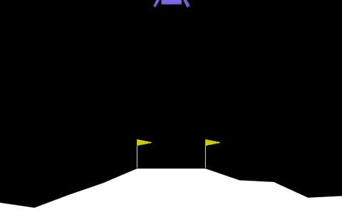
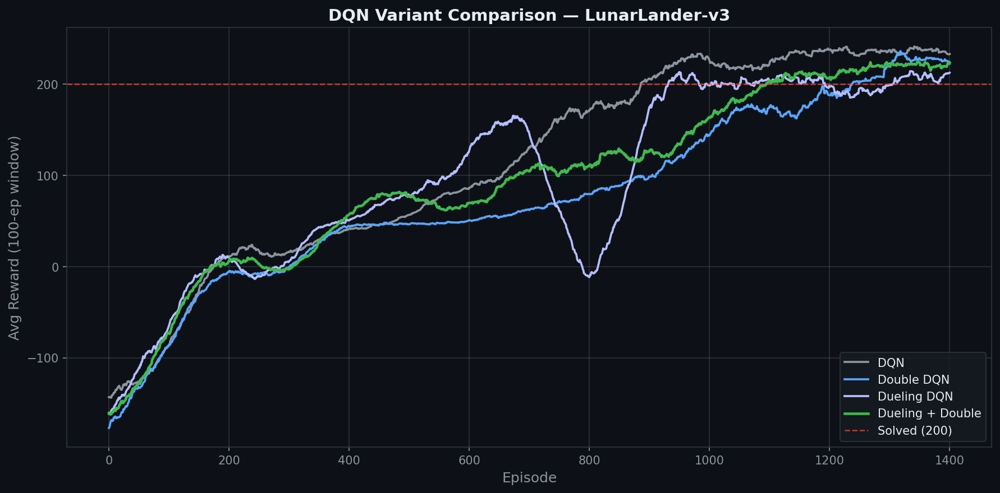

# Deep-Q-learning-for-Lunar-Landing

Implementing and comparing four DQN variants on the LunarLander-v3 environment
using PyTorch and Gymnasium.

## Demo



## Variants Compared

| Variant | Double | Dueling | Final Avg100 | Episodes to ~200 |
|---|---|---|---|---|
| DQN | ✗ | ✗ | **233** | ~1000 |
| Double DQN | ✓ | ✗ | 223 | ~1400 |
| Dueling DQN | ✗ | ✓ | 213 | ~1050 |
| Double Dueling DQN | ✓ | ✓ | 224 | ~1200 |



**Key finding:** Vanilla DQN converged fastest and scored highest. On LunarLander-v3,
the reward signal is dense and well-shaped, so the overestimation bias that Double DQN
corrects is not a bottleneck. Dueling DQN showed training instability around episodes
850–900, suggesting the value/advantage decomposition doesn't suit this task's structure.

## Environment

[LunarLander-v3](https://gymnasium.farama.org/environments/box2d/lunar_lander/) — land
a rocket between two flags using four discrete actions (do nothing, left engine, main
engine, right engine). Episode is solved at an average reward of 200 over 100
consecutive episodes.

## Architecture

A single `Network` class handles both standard and dueling architectures via a `dueling` flag:
- **Shared layers:** 128 → 128 (ReLU)
- **Standard head:** advantage stream → Q-values
- **Dueling head:** value stream V(s) + advantage stream A(s,a), combined as
  Q(s,a) = V(s) + (A(s,a) − mean(A(s,a)))

## Hyperparameters

| Parameter | Value |
|---|---|
| Replay buffer size | 100,000 |
| Batch size | 128 |
| Discount factor γ | 0.99 |
| Soft update τ | 0.001 |
| Learning rate | 3e-4 |
| Epsilon start → min | 1.0 → 0.05 |
| Epsilon decay | 0.995 |
| Episodes per variant | 1,500 |

## Getting Started

### Prerequisites
```bash
pip install -r requirements.txt
```

### Running locally
Open `dqn-lunar-lander.ipynb` in Jupyter or VS Code.

> **Note:** Checkpoint and video output paths are set to `/kaggle/working/`. If running
> locally, replace these with a relative path like `checkpoints/` and add
> `os.makedirs("checkpoints", exist_ok=True)`.

### Running on Kaggle
Upload the notebook directly — paths are already configured for Kaggle's working directory.

## Results

All four variants were trained for 1,500 episodes each (~75 minutes on a T4 GPU).
The vanilla DQN reaches the solved threshold (~200) around episode 1,000 and peaks at
an average reward of 233. More complex variants converge slower and finish lower —
an example of where simpler is better.

## References

- [Human-level control through deep reinforcement learning](https://www.nature.com/articles/nature14236) — Mnih et al., 2015 (DQN)
- [Deep Reinforcement Learning with Double Q-learning](https://arxiv.org/abs/1509.06461) — van Hasselt et al., 2015
- [Dueling Network Architectures for Deep Reinforcement Learning](https://arxiv.org/abs/1511.06581) — Wang et al., 2015
- [Gymnasium Documentation](https://gymnasium.farama.org/)
